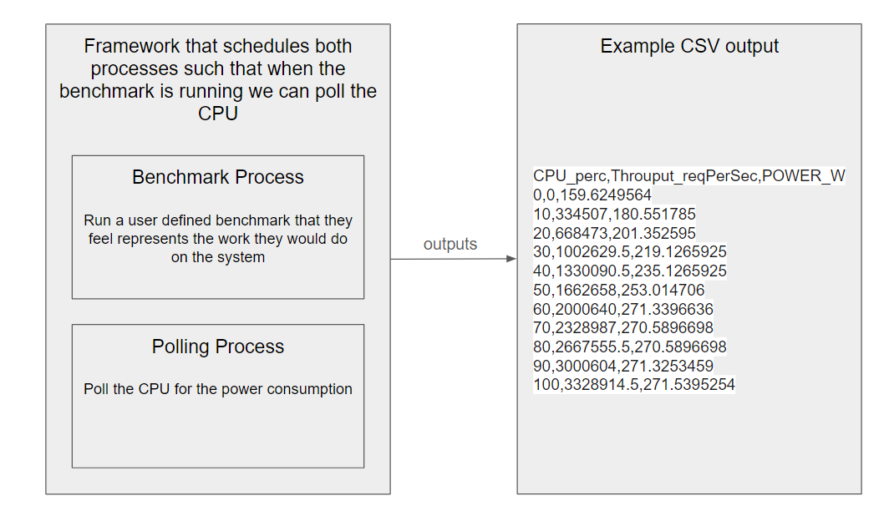

# Green Chips Powercurve Generator
Power loadlines serve as crucial tools for estimating energy consumption in systems or software, especially in scenarios lacking direct access to power registers or operating in environments obscuring hardware details. Despite their practicality, loadline estimation may not always yield precise energy consumption figures due to workload behavior variations, environmental conditions, and hardware characteristics. The industry standard tools for generating power loadlines, SPECPower and SERT, while effective, have limitations such as requiring direct hardware access and relying on standard benchmarks that may not cover all software scenarios adequately. Opensource solutions like Teads and CodeCarbon also utilize loadlines, but they may lack flexibility for certain user scenarios. To address these limitations, we propose developing a framework enabling users to generate personalized power loadlines. While not as accurate as industry-standard tools, our framework aims to provide developers with energy estimates more likely to reflect their unique situations.

## Requirements
Please install packages in requirements.txt: `pip install -r requirements.txt`

## Limitations
Please note that you will need a Linux distribution to run this code and the system must have a processor that is Sandy Bridge or newer.

## Test it out
To get started, we have coded two benchmarks: `matmult_bench.py` and `nginx_bench.py`
`nginx_bench.py` has some known issues that we are still working through.

Cmdline support will be available soon to pass in parameters, but if you'd like to change which benchmark to run,
please edit line 167 in `green_chips.py`. 

To run generate the powercurve, run `python green_chips/green_chips.py`

## How it works
Here's a diagram of the basic framework. The framework uses the `multiprocessing` library to communicate.

## Adding a new benchmark
If you'd like to write your own benchmark, it's fairly simple to get started. 
1. Create a new class that inherits the `Benchmark` class in `benchmark_base.py`. It is critical that you inherit this class for `green_chip` to run the benchmark.
2. The only function you need to define in the benchmark class is `run()`. You can define whatever classes or functions you need, but `run()` must be defined.
3. The benchmark passes information back to the framework using `multiprocessing.queue`. Add the benchmarking data to the queue to generate the curve.

## Next steps
This is very much a work still in progress. Here is a general list of next steps that will be added as issues in the near future:
* Test in a variety of environments (i.e. containerized envs, different baremetal envs, etc.)
* Look more into how to measure power for applications running on a single socket or across multiple sockets
* Test functionality for hyperthreaded applications
  - May require code changes to accommodate multiple threads
* Add more support for cmdline
* Add support for AMD processors
* Add test cases/CI
* Learn more about power in general to understand more about why we see the results we do
* Make the scripts a bit more dynamic to respond to what information the benchmark is wanting to collect
* Add more structure to the data that is being passed between the Benchmark and GreenChips. It should be more clear what data and in what format the data should be passed.
* Add more documentation/resources about results
* Make framework more robust in general