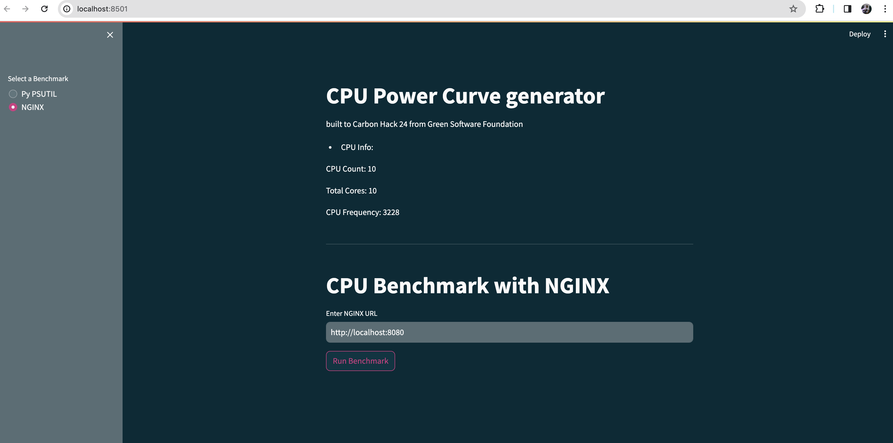

## CPU Power Curve using Python with Streamlit
Sample created to help understanding

Benchmarks: 
- [Psutil](https://pypi.org/project/psutil/) 
- NGINX using [WRK](https://github.com/wg/wrk)


How to test:
```bash
$ streamlit run greenchips.py
```

debug mode:
```bash
streamlit run greenchips.py --logger.level=debug 3
```

### screens




